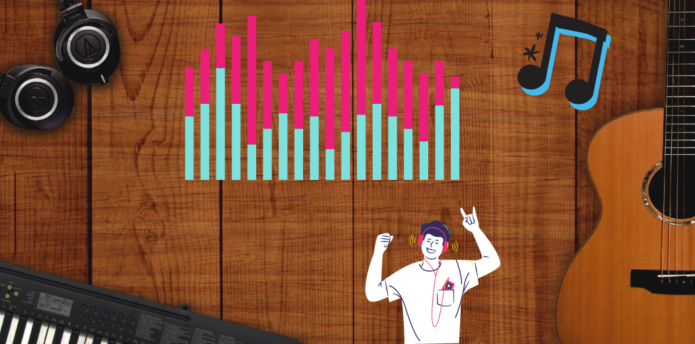
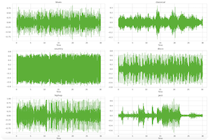
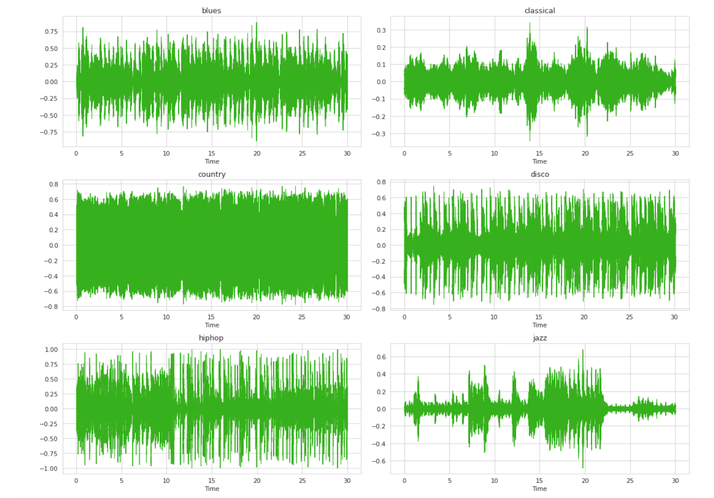

# 🎶 Music Genre Classification using Machine Learning 🎶

## Overview
Machine Learning has several different use cases like classification, regression, prediction on different kinds of data such as images, text, audio, video, etc. Audio processing is one of the most complex tasks in data science compared to image processing and other data processing techniques.

One such application of audio processing is music genre classification. It aims to categorize audio files into specific genres based on various features.

## Motivation
- We have previously worked with numerical and image data in past projects. We didn’t want to do anything similar again.
- Our main intention was to, of course, get a good grade and also learn something new.
- Hence, we decided to work with audio data.
- We believed it would help us gain a deeper understanding of how audio files are analyzed and how different it is from numerical and image data.

## Dataset
**GTZAN Genre Collection** (by George Tzanetakis)
- **Genres**: Blues, Classical, Country, Disco, Hip-hop, Jazz, Metal, Pop, Reggae, Rock
- **Number of Genres**: 10
- **Duration**: 30 Seconds
- **Number of Audio files per Genre**: 100
- **Format**: 22050 Hz, Monophonic, 16-bit audio files in .wav format

## Experimental Setup
1. **Librosa**: A Python package designed primarily for music analysis of audio inputs. The building blocks for a MIR (Music Information Retrieval) system are included.
2. **IPython.display.Audio**: Enables you to play audio files directly in the notebook.
3. **Scikit Learn**
4. **Tensorflow**
5. **Numpy**
6. **Pandas**
7. **Matplotlib**

## What is Audio Data?
Audio data represents analog sounds in a digital form, preserving the main properties of the original. It has three key characteristics to be considered when analyzing audio data:
- **Time period**: How long a certain sound lasts.
- **Amplitude**: The sound intensity measured in decibels (dB) perceived as loudness.
- **Frequency**: Measured in Hertz (Hz), indicates how many sound vibrations happen per second, interpreted as low pitch or high pitch.

## Data Visualization
To analyze audio data, there are different features that can be studied and analyzed. Some of the features include:
- **Waveform**
- **Short-time Fourier Transform (STFT)**
- **Spectrogram**
- **Mel Spectrogram**
- **Zero Crossing Rate (ZCR)**
- **Spectral Centroid**
- **Spectral Rolloff**
- **Spectral Bandwidth**
- **Mel Frequency Cepstral Coefficients (MFCC)**
- **Chromagram**

## Approaches
### Current Approaches
1. Artificial Neural Networks
2. CNNs
3. Other classification models

### Our Approaches
1. K-Nearest Neighbor (KNN)
2. Random Forest Classification
3. Artificial Neural Networks (ANN)
4. Convolutional Neural Networks (CNN)

## Pre-processing
The data we had was in audio format, and we had two options:
1. Convert the audio to numerical data.
2. Convert the audio to image data.

We decided to begin with numerical data. With the initial 1000 audio files, we built a .csv file that had all the features (rmse, spectral centroid, rolloff, etc.) in terms of numbers using the `librosa` library. We also used an encoding technique to transform all the target genres into integers.

Next step was to standardize/normalize the data. We used four different methods for normalization:
1. Standardization
2. L1 Normalization
3. L2 Normalization
4. MinMax Normalization

## Challenges and Workaround
Initially, our dataset was too small, and we couldn’t achieve an accuracy higher than 70%. To increase the data, we split each 30-second audio file into 10 parts of 3 seconds each and recorded individual feature values. This increased our dataset to approximately 10,000 rows.

## Results
After implementing KNN, Random Forest, ANN, and CNN, we observed significant improvements in our model accuracy. Below is a summary of our findings:

- **KNN**: Simplicity and initial exploration.
- **Random Forest**: Improved accuracy with ensemble learning.
- **ANN**: Custom neural network with iterative improvements.
- **CNN**: Enhanced classification using image data from audio signals.

## Conclusion
Through this project, we automated the tedious process of classifying audio files into genres using machine learning and deep learning techniques. We gained insights into audio data processing and explored various algorithms to achieve optimal classification accuracy.

## License
This project is licensed under the MIT License - see the [LICENSE](LICENSE) file for details.

